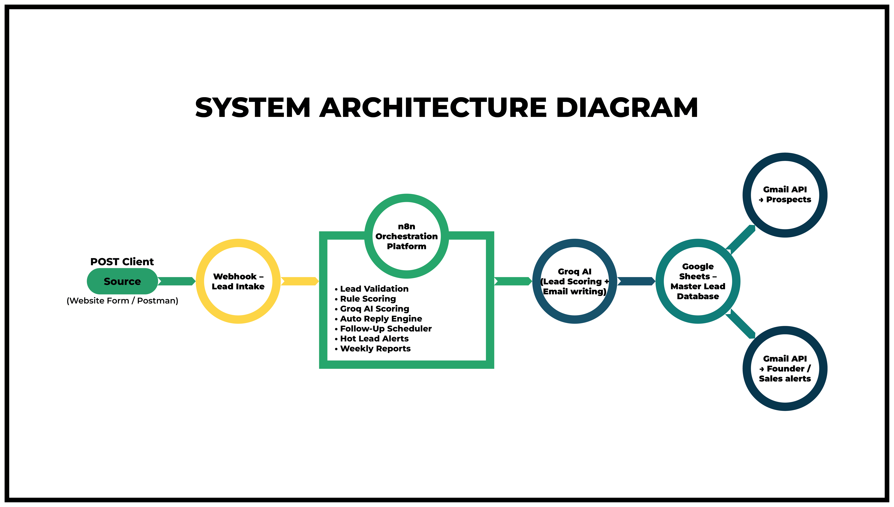

# 🚀 Automated Lead Management & AI Follow-Up System (n8n + Groq)

A **production-grade AI automation system** designed to capture, score, and nurture leads using fully-orchestrated workflows built in **n8n** with **Groq LLM integration**.

This project demonstrates end-to-end real-world automation engineering including:

✅ API-based lead intake  
✅ Rule-based + LLM lead scoring  
✅ AI-generated email replies  
✅ Multi-stage follow-up automation  
✅ High-priority lead alerts  
✅ Scheduled performance reporting

---

## ⚙️ Technology Stack

| Layer | Tools |
|------|-------|
| **Automation Engine** | n8n (Self-Hosted via Docker) |
| **LLM Scoring & Content** | Groq API (LLaMA-3.3-70B) |
| **Datastore / CRM** | Google Sheets API |
| **Email Delivery** | Gmail API (OAuth 2.0) |
| **Workflow Logic** | JavaScript |
| **Testing** | Postman |

---

---

## 🧠 System Architecture



---

---

## 🔁 Workflow Breakdown

---

### ✅ Workflow 1 — Lead Capture API

Webhook API captures new inbound leads from:

• Website forms  
• CRMs / integrations  
• Direct API clients (Postman)

Validation & normalization occurs before storing into the **Google Sheets lead database**.

---

---

### ✅ Workflow 2 — Lead Scoring (Hybrid AI + Rules Engine)

Each lead is processed using both:

#### Rule-Based Scoring
Evaluates:
- Budget size
- Service intent
- Lead source reliability
- Message clarity & length

Produces a **Rule Score (0–60)**.

#### AI Scoring (Groq LLM)

The full lead profile is sent to Groq’s LLaMA-3.3 model to generate:

- **AI Score (0-100)**  
- Short quality reasoning

---

#### Combined Lead Intelligence Output

```json
{
  "leadScore": 0–100,
  "aiScore": 0–100,
  "priority": "HIGH | MEDIUM | LOW",
  "nextFollowUpAt": "ISO Timestamp",
  "scoredAt": "ISO Timestamp"
}
```

### ✅ Workflow 3 — Instant Auto-Reply

Immediately after scoring:<br>
<br>
• Personalized email reply is generated<br>
• Gmail API dispatches to the prospect<br>
• Subject + content logged inside the CRM<br>
<br>
### ✅ Workflow 4 — Follow-Up Automation
<br>
Scheduled campaigns trigger:<br>

| Stage |	Timing |
|-------|-------|
| Follow-Up 1 |	+1 Day |
| Follow-Up 2 |	+3 Days |
| Follow-Up 3 |	+7 Days |

Emails are only sent if:<br>
<br>
✅ Lead has not replied<br>
✅ Lead is not marked closed<br>
✅ Follow-up step hasn’t already been executed<br>
<br>
### ✅ Workflow 5 — High-Priority Alerts
<br>
When:<br>
```json
"priority": "HIGH"
```
<br>
The system instantly:<br>
<br>
• Emails founder/sales team<br>
• Adds record to Hot Leads List<br>
• Locks lead to prevent duplicate alerts<br>
<br>
### ✅ Workflow 6 — Weekly Analytics Summary
<br>
Every Monday:<br>
<br>
• Total weekly leads<br>
• Priority breakdowns<br>
• Auto-reply & follow-up metrics<br>
• Hot-lead alert counts<br>
<br>
All statistics are emailed as a business performance report.<br>
<br>
## 🛠️ Key Engineering Capabilities Demonstrated
<br>
✅ End-to-end workflow automation at production scale<br>
✅ OAuth 2.0 API integrations (Google Sheets / Gmail)<br>
✅ Prompt engineering & LLM output parsing<br>
✅ Hybrid AI + deterministic decision systems<br>
✅ Scheduled task orchestration<br>
✅ Data normalization & merging pipelines<br>
✅ Alerting systems & reporting loops<br>
✅ Docker-based self-hosting<br>
<br>
## 🎯 Business Value Delivered
<br>
This system replaces hours of weekly sales manual work by:<br>
<br>
✔ Automating lead qualification<br>
✔ Improving response speed<br>
✔ Preventing opportunity loss<br>
✔ Maintaining clean CRM records<br>
✔ Ensuring hot-lead visibility<br>
<br>
Perfect for:<br>
<br>
• Marketing agencies<br>
• SaaS sales teams<br>
• Consultants<br>
• Lead generation businesses<br>
<br>
## 👨‍💻 Author
Varun Wagle<br>
AI Automation Developer | Workflow Engineer | LLM Integrator<br>

## 💬 Contact
Reach out on [LinkedIn](https://www.linkedin.com/in/varunwagle/) for collaborations or freelance AI automation projects.
